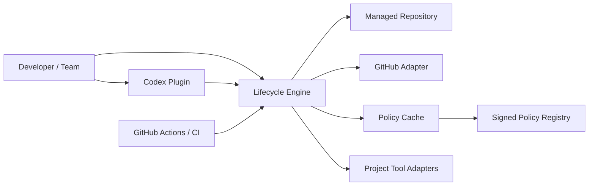

# Codex Starter Kit — Architecture

**Status:** Draft build specification  
**Source decisions:** `docs/discovery/CODEX_STARTER_KIT_REVIEW.md`

## System Context

The system turns project intent and repository evidence into controlled lifecycle
operations and reproducible conformance results.



## External Seam

The lifecycle engine presents one interface to plugin, CLI, CI, and tests:

Before selecting an operation, adapters may call the read-only `capabilities` metadata
handshake. It reports identity, protocol/schema, and implemented-operation facts without
repository access or a self-issued verification claim.

| Operation | Result |
|---|---|
| `create` | Approved plan for initializing an empty/new project |
| `retrofit` | Assessment and conformance plan for an existing project |
| `inspect` | Read-only facts, risks, applicability inputs, drift, and conflicts |
| `plan` | Immutable proposed operations with preconditions and impact |
| `apply` | Transactional application result or explicit recoverable failure |
| `verify` | Control results, coverage, evidence, and conformance summary |
| `status` | Lifecycle, synchronization, versions, risks, and incomplete setup |
| `upgrade` | Semantic engine/policy/template migration plan and application |

Plans are data, not shell scripts. Every mutating operation consumes a plan identifier,
checks that its preconditions still hold, and records the result.

## Modules

### Lifecycle Engine

Deep module owning orchestration, transitions, plan composition, transaction boundaries,
and result semantics. It accepts injected adapters and never asks an AI to perform a
mechanical invariant. DEC-0015 selects a Go implementation, but consumers depend on the
language-neutral operation, schema, result, and evidence contracts rather than Go types.

### Project Classifier

Combines detected repository facts with approved human answers. It distinguishes
observations, declarations, derived facts, confidence, provenance, and review status.
It seeds persona proposals from audience evidence but requires human confirmation.

### Policy Compiler

Resolves locked packs, evaluates applicability rules, layers organization/project
policy, applies exception rules, and emits the effective policy graph. It never makes
unbounded legal conclusions; uncertainty becomes `needs-review`.

Assurance additions from DEC-0019 attach at repository, work-item, or release scope and
compose additively with the universal and otherwise applicable graph. A narrower scope
may strengthen but never remove a governing requirement; unresolved conflicts become
`needs-review`. Engagement mode and evidence presentation remain separate inputs rather
than policy-strength selectors.

### Control Evaluator

Executes automated controls, assembles human-attestation requests, validates evidence,
and produces the state model: `pass`, `fail`, `not-applicable`, `not-configured`,
`needs-review`, or `accepted-exception` with the underlying result retained.

### Artifact Manager

Owns generated/managed/user-owned classification, hashes, rendering, conflict detection,
atomic writes, rollback, and migration. User-owned prose is not regenerated silently.

### Context Router

Resolves stable IDs, validates breadcrumbs, generates the effective-policy index, and
enforces routing/context budgets. It provides focused material to skills and issues.
It routes the effective operating-profile identity, mandatory interrupts, and the minimum
concise receipt while preserving links to expanded evidence.

### Layout Manager

Maps logical directory roles to repository paths, evaluates capability triggers, and
plans structural expansion or retrofit. It understands symlinks, case sensitivity,
reserved names, and platform-native path behavior.

### Work Manager

Renders and validates executable issues, readiness, hierarchy, labels, Project fields,
Horizon roadmap, and completion memory. It owns desired state; the GitHub adapter owns
transport.

### Release Manager

Selects release adapters, composes change records, runs release gates, versions
transactionally, records provenance, and generates audience-specific communication.

### Upgrade Manager

Compares semantic versions and manifests, computes policy/control/evidence/layout
effects, creates migrations, and retains prior state. Plugin update and repository
upgrade remain separate.

### Evidence Store

Writes content-addressed local evidence, machine manifests, and human summaries. Remote
artifact stores are adapters. Secrets and sensitive evidence follow policy retention and
redaction rules.

## Adapters

| Adapter | Category | Test approach |
|---|---|---|
| Filesystem/Git | Local-substitutable | Temporary real repositories on native OS runners |
| GitHub | True external | In-memory adapter + GitHub contract/sandbox tests |
| Policy registry/signature | Remote but owned | Local registry/signing fixture + production contract tests |
| Clock/identity/approval | In-process | Deterministic fakes |
| Process/tool runner | Local-substitutable | Fake runner plus allowlisted native integration fixtures |
| Codex plugin/skills | Adapter | Scenario/evaluation tests against engine calls and artifacts |
| Release/publish/deploy tools | True external | Per-adapter mocks, sandboxes, and provider contract tests |

### Codex plugin compatibility boundary

[DEC-0018](../decisions/DEC-0018-codex-plugin-compatibility-and-distribution.md)
defines the Phase 2 adapter as a skills-only plugin distributed through a repository
marketplace for development and an immutable Git-backed snapshot for qualification. It
adds no MCP server, connector, hook, browser extension, scheduled task, or remote service.

Every focused workflow performs a non-mutating capability handshake across the host,
plugin, engine, managed-repository pins, baseline, native environment, approvals, and
requested authority. The result is exactly `full`, `degraded-guidance`,
`verification-only`, or `unsupported`. These are workflow capability states, not
conformance results, and no state may reinterpret the engine's explicit evidence.

Client versions are retained as evidence but do not establish compatibility alone. Codex
CLI is the required development surface; desktop support requires native qualification;
IDE plugin distribution remains `needs-review` while official documentation conflicts.
Plugin, engine, repository, and policy versions remain independent, and direct engine use
is always the fallback.

## Repository Contract

Proposed logical contents; exact filenames require schema design:

```text
AGENTS.md                         concise orientation and routes
.starter-kit/
  project.yml                     approved/detected project facts
  policy.lock                     engine and policy pack pins/digests
  layout.yml                      logical role to physical path mapping
  managed-files.json              provenance, ownership, hashes
  state.json                      lifecycle/schema/synchronization state
  routes.json                     generated stable-ID resolution index
docs/
  product/                        approved brief and audience records
    PERSONAS.md                   human-owned stable persona registry
  decisions/                      human-owned decisions
  risks/                          exceptions and residual risks
  specs/                          approved behavior specifications
  evidence/                       human summaries/indexes, not raw secrets
```

Generated files carry a source state version/digest. Local policy packs live in an
immutable external cache by default and may be vendored under a reserved managed path.

## Policy Pack Contract

A pack contains:

- identity, semantic version, content digest, publisher, signature;
- compatible engine/schema ranges and pack dependencies;
- focused standards and templates with stable IDs;
- control definitions: applicability, evaluation, enforcement, exception policy;
- evidence schemas and retention sensitivity;
- routing metadata and “load when” descriptions;
- optional layout roles/rules and migrations;
- semantic changelog identifying strengthened/weakened obligations.

Packs are immutable. Project customization is a separate project policy layer.

## Plan and Transaction Model

A plan contains detected inputs and hashes, proposed operations, control/policy impact,
required approvals, rollback/recovery behavior, and expiration. Apply performs:

1. lock repository lifecycle state;
2. recheck plan preconditions and authority;
3. stage filesystem/state mutations;
4. perform reversible local operations;
5. perform approved external operations with idempotency keys;
6. verify postconditions;
7. commit local state and evidence;
8. report/reconcile partial external failure.

External systems prevent perfect distributed transactions. The engine uses idempotency,
desired-state reconciliation, and compensating operations rather than claiming atomicity
it cannot provide.

## Security Model

- Repository content, policy packs, issue text, tool output, and generated artifacts are
  untrusted inputs until validated.
- Paths are normalized and constrained to approved roots; symlink traversal and reserved
  path attacks are tested.
- Commands are structured executable/argument/environment definitions, never interpolated
  shell strings.
- Secrets are not stored in plans, logs, issue bodies, or ordinary evidence.
- Plugin and engine never weaken Codex/user/admin sandbox or approval configuration.
- Network and external mutations require explicit adapter capability and policy authority.
- Signatures/digests establish pack and engine provenance; a remembered description is
  never equivalent to verified content.
- Evidence states coverage honestly; failures in evaluators cannot default to pass.
- AI actors must identify the applicable human persona(s); agent convenience cannot
  override audience outcomes, authority, accessibility, or communication needs.

### Sensitive-data assurance boundary

V1 records one project declaration: whether the project intentionally contains or
processes information requiring special confidentiality, privacy, contractual, or
regulatory handling. Allowed values are `No`, `Yes`, and `Unsure`; the value is a
human-owned declaration with provenance, not a tool-derived legal conclusion.

`Yes` and `Unsure` trigger a concise notice and explicit acknowledgment. The state model
keeps three facts separate:

- **content classification:** what handling the project says its information requires;
- **handling authorization:** whether a named actor may expose that information to a
  named tool, service, or environment for a bounded purpose; and
- **product assurance:** evidence that the complete route can provide the required
  handling guarantees.

Acknowledgment proves only that the notice was presented and accepted for workflow
continuation. It grants no handling authority and supplies no assurance evidence. Without
a verified sensitive-data route, the engine may inspect metadata, plan, document, and
guide remediation without exposing the content. Determinations requiring qualified
interpretation are `needs-review`; operations that require the unavailable route are
`unsupported`. No adapter may silently transmit content, activate a tool, or broaden
authority to escape either state.

## Versioning

Version independently:

- plugin UX/skill bundle;
- lifecycle engine;
- repository schema;
- policy packs;
- templates/layout modules.

The repository pins compatible versions. Compatibility metadata and migrations connect
them. Releases retain the exact effective-policy digest and engine version.

## Observability

Every operation emits a structured event with operation/plan ID, actor, authority,
repository/source revision, versions, changed artifacts, external effects, result, and
redacted diagnostics. Human summaries link events without exposing sensitive raw logs.

## Architecture Validation

- The lifecycle engine interface is the highest test seam.
- Deleting an adapter must not scatter policy logic into callers.
- Two adapters justify real seams: GitHub fake/production, registry local/remote,
  filesystem temporary/native, and process fake/native.
- Internal modules are not public merely for testing; tests cross the engine interface.
