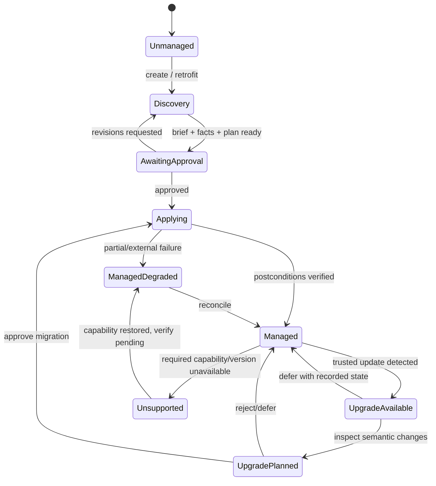
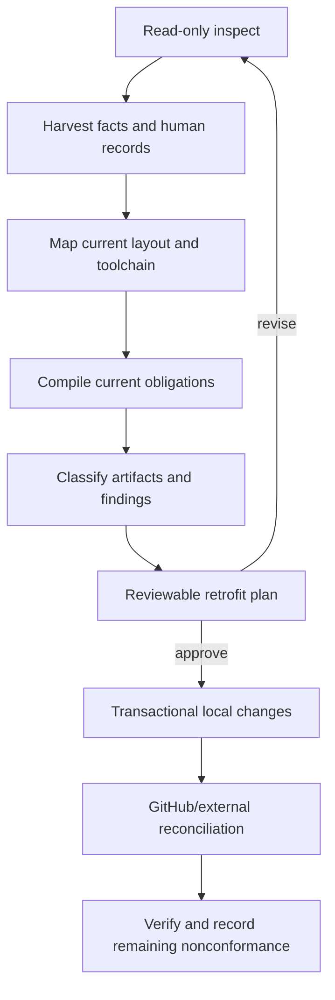
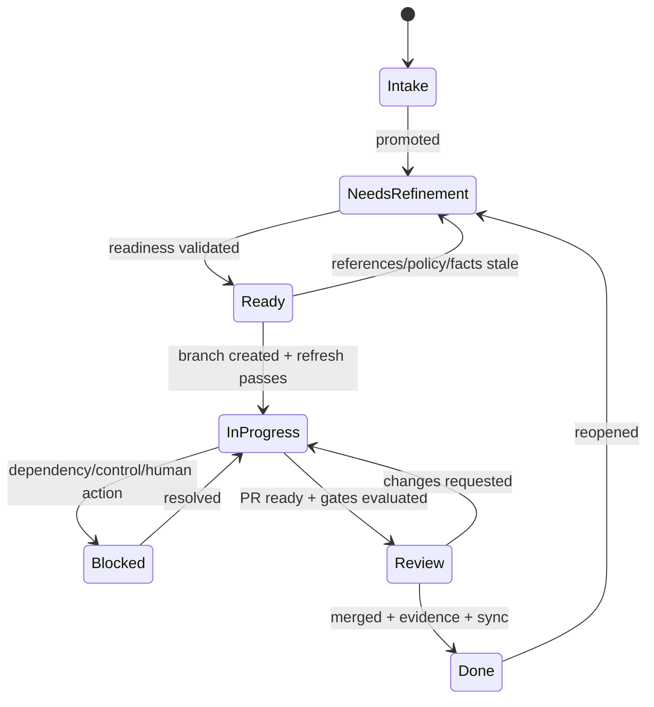
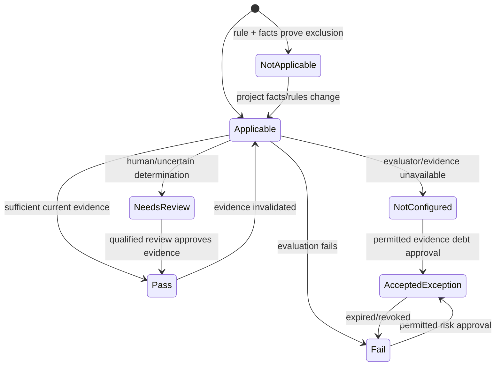
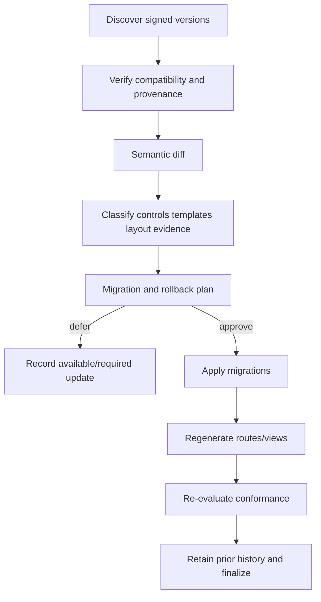

# Codex Starter Kit — Lifecycle State Machines

**Status:** Draft build specification

## Managed Repository Lifecycle



`Managed` does not mean every control passes; it means the repository contract is valid
and control states are truthfully represented. Overall conformance is evaluated for a
specific scope and lifecycle gate.

## Create Lifecycle

1. Inspect environment and empty/existing repository facts read-only.
2. Draft or ingest a human project brief.
3. Obtain brief approval before targeted questions.
4. Collect/detect structured facts with provenance and confidence.
5. Classify project outputs, users, data, deployment, collaboration, and regulation.
6. Compile policy and layout roles.
7. Generate a plan: files, GitHub setup, tools, human actions, risks, and evidence.
8. Obtain approvals/install authority.
9. Apply locally, then reconcile GitHub/external desired state.
10. Verify repository contract and emit initial conformance/coverage summary.

## Retrofit Lifecycle



Artifact classifications are `adopt`, `transform`, `retain-as-history`, `supersede`,
`conflict`, or `unsupported`. Existing violations become findings/issues; retrofit does
not rewrite history to imply prior compliance.

## Work Item Lifecycle



Implementation cannot begin from `Intake` or `NeedsRefinement`. A stale Ready issue is
refined; the implementing AI does not invent unresolved decisions.

## Control Evaluation Lifecycle



`AcceptedException` retains the underlying failed/incomplete result. Prohibited
exceptions never transition to accepted.

## Gate Enforcement

Controls declare their earliest blocking gate:

```text
plan < local-mutate < commit < external-mutate < pr-ready < merge < release < conform
```

An unavailable control may allow earlier safe activity but blocks at its declared gate.
Later gates cannot weaken earlier enforcement.

## Release Lifecycle

1. Select merged scope and release adapter.
2. Resolve change records and proposed identifier.
3. Freeze candidate source, engine, policy, dependencies, and environment facts.
4. Evaluate release-blocking controls and risks.
5. Generate release plan, communications, rollback, and approvals.
6. Apply transactional version/change-record updates.
7. Build and verify immutable artifacts.
8. Tag/release/publish/deploy through approved adapters.
9. Record digests, provenance, environment, approvals, and evidence.
10. Reconcile issues, milestones, Project, and stakeholder views.

Partial publication produces `ManagedDegraded` and a reconciliation/incident plan; it
cannot be summarized as a successful complete release.

## Upgrade Lifecycle



Urgently revoked versions may create a blocking obligation, but still do not authorize
silent repository mutation.

## Risk Lifecycle

Corrective exceptions expire on a remediation deadline. Residual risks expire on a
review schedule. Expiration or material scope/fact changes return the underlying control
to blocking. Closure requires evidence that the risk was removed or superseded, not just
that the associated issue was closed.
