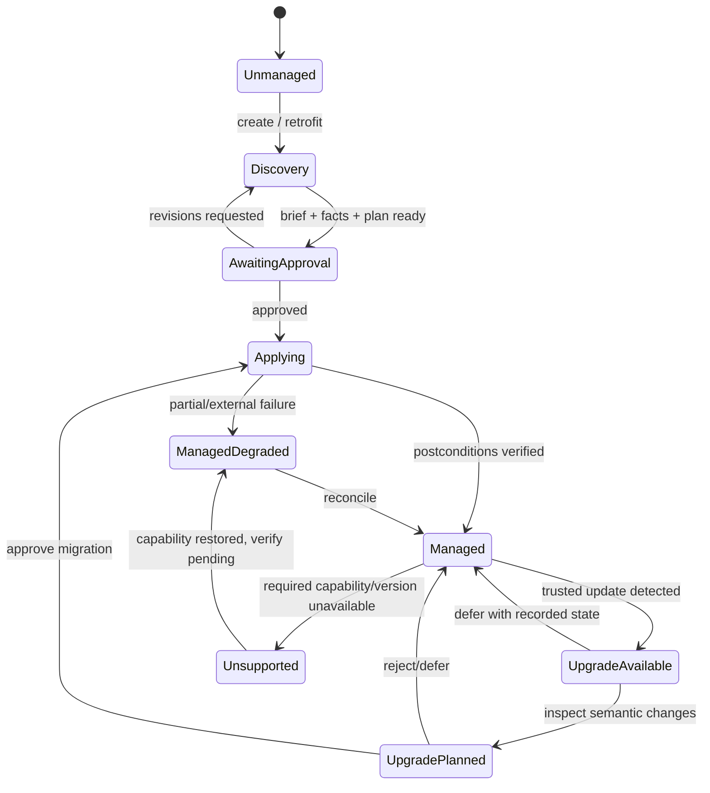
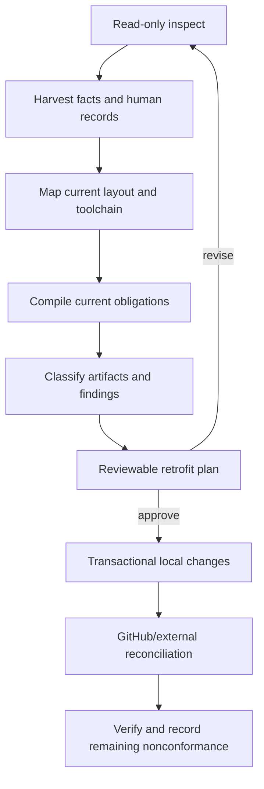
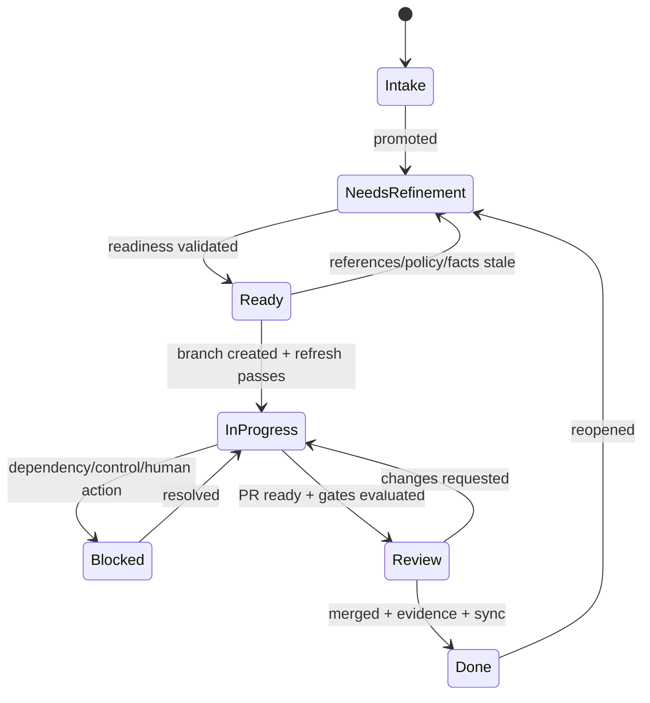
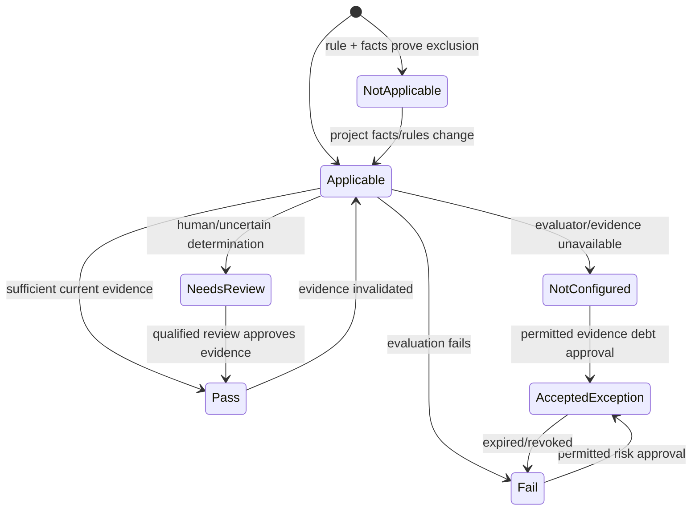
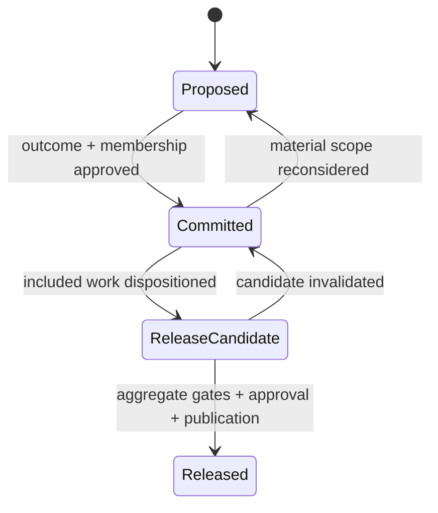
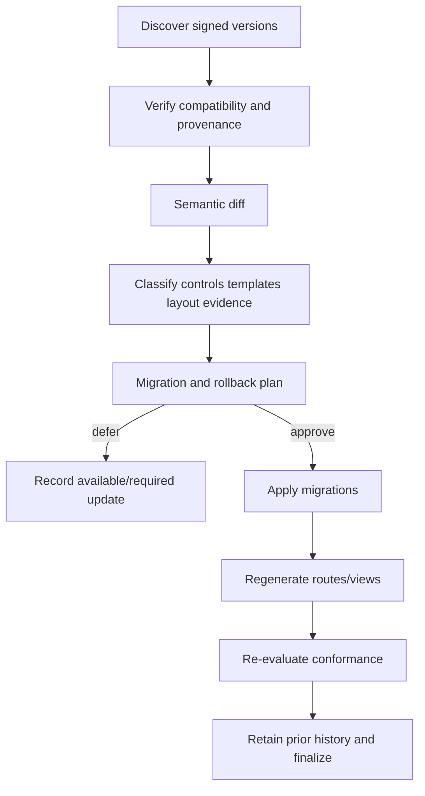

# Codex Starter Kit — Lifecycle State Machines

**Status:** Draft build specification

## Managed Repository Lifecycle



`Managed` does not mean every control passes; it means the repository contract is valid
and control states are truthfully represented. Overall conformance is evaluated for a
specific scope and lifecycle gate.

## Create Lifecycle

1. Inspect environment and empty/existing repository facts read-only.
2. Draft or ingest a human project brief.
3. Obtain brief approval before targeted questions.
4. Collect/detect structured facts with provenance and confidence.
5. Record whether special data handling is intentional: `No`, `Yes`, or `Unsure`.
6. For `Yes` or `Unsure`, present the concise data-handling notice and record explicit
   acknowledgment without treating it as authorization or assurance.
7. Classify project outputs, users, data, deployment, collaboration, and regulation.
8. Compile policy, layout roles, coverage limits, and required capability states.
9. Generate a plan: files, GitHub setup, tools, human actions, risks, and evidence.
10. Obtain approvals/install authority; never infer content-handling authority from the
    notice acknowledgment.
11. Apply locally, then reconcile GitHub/external desired state. If an operation needs an
    unavailable verified sensitive-data route, report `unsupported` before transmission.
12. Verify repository contract and emit initial conformance/coverage summary, retaining
    `needs-review` for unresolved sensitive or regulatory determinations.

The `No` path does not trigger a detailed privacy interview. Any later fact that
contradicts the declaration invalidates affected applicability and evidence. `Yes` and
`Unsure` do not block safe metadata-only planning or remediation, but they cannot yield a
pass for sensitive-data handling or regulatory conformance without current evidence.

The `Yes`/`Unsure` notice must say, in concise project-appropriate language:

- the declaration triggered the notice;
- the current Codex, tool, service, and environment route is not assumed verified for the
  content;
- the user should not supply or transmit that content until handling authorization and
  route assurance are established;
- safe metadata-only planning and remediation can continue; and
- acknowledgment only records receipt of the notice.

| Requested work | Missing verified route outcome |
|---|---|
| Read metadata, record the declaration, plan, or document limitations without exposing content | Continue with explicit coverage limits |
| Determine legal, contractual, privacy, or regulatory applicability | `needs-review` unless qualified current evidence resolves it |
| Read, transform, transmit, or expose specially handled content through the unverified route | `unsupported`; provide safe next actions |
| Activate a new tool, integration, or authority as a workaround | Require separate informed approval and capability verification |

Safe next actions are progressive and do not require the user to disclose the content:

1. identify the project or organization policy owner and the person authorized to decide
   how the content may be handled;
2. record the proposed data scope, purpose, actor, tool/service/environment route,
   recipients, retention, and authorization expiry;
3. have the applicable security, privacy, contractual, regulatory, or other qualified
   reviewer confirm the required guarantees and acceptable evidence;
4. verify the complete route against those requirements and retain the evidence; or
5. use redacted, minimized, synthetic, or otherwise approved non-sensitive material for
   the current work. If no suitable route or substitute exists, do not perform the
   content-handling operation and link the deferred capability to issue #21.

## Retrofit Lifecycle



Artifact classifications are `adopt`, `transform`, `retain-as-history`, `supersede`,
`conflict`, or `unsupported`. Existing violations become findings/issues; retrofit does
not rewrite history to imply prior compliance.

## Work Item Lifecycle



Work cannot begin from `Intake` or `NeedsRefinement`. A stale Ready item is refined; the
assigned human or AI does not invent unresolved decisions.

Readiness and completion are subtype-specific:

- implementation work has stable governing references, verifiable acceptance, required
  tests/evidence, and a linked completing change;
- question work names the consequential question, impact, blocking versus related work,
  answer authority, evidence needs, resolution criteria, and promotion destination;
- research work names an objective or bounded exploratory mapping goal, intended use,
  scope and exclusions, source/provenance expectations, authorized depth or effort,
  stopping conditions, durable output, freshness, and review needs.

A question closes only after a material answer is promoted into its authoritative record
or explicitly resolved as requiring no promotion. When promoted, the record references the
issue and the issue's closing comment references the record. Research closes with a
durable human-owned research record and any resulting question, decision, or delivery
work; the record informs but does not silently establish authority.

Project fields project this lifecycle along separate dimensions. Readiness answers
whether execution may start, Status records selection and progress, and Horizon records
feature intent. Dependency completion is a transition trigger: every direct dependent is
re-evaluated and becomes Ready when its last blocker resolves. Readiness alone does not
select it as Status Next. An incomplete parent is In progress after any child delivery
starts or completes, even when its remaining Ready children are still Backlog. Completion
of every native child closes the parent as Done unless an unsatisfied parent criterion is
represented by a concrete outstanding child.

The implemented one-task Work Manager route projects this policy through an explicit
`inspect → plan → apply → verify → status` sequence. Apply rechecks the governed source,
operating profile, normalized observation, actor, permission, target/configuration IDs,
and expiry. Offline intent is retained without credentials; reconnect requires a fresh
handshake. Partial, ambiguous, denied, rate-limited, exhausted, and stale results retain
receipts and recovery rather than advancing the lifecycle. See
[the managed-task lifecycle contract](WORK_MANAGER.md).

The production GitHub adapter performs the same sequence through a fixed target manifest
and ephemeral credential provider. Its handshake binds API actor, credential mode,
installation/account where applicable, repository and Project owner/IDs, pinned API
version, permissions, budgets, expiry, and evidence mode. Stable-marker reads precede
creates; one match recovers, multiple matches are ambiguous, and GraphQL partial data is
`needs-review`. Deterministic HTTP receipts remain `simulated`; live effects remain
`not-configured` until the separately approved sandbox exists. See
[the GitHub adapter contract](GITHUB_ADAPTER.md).

## Professional Engineering Baseline

Every supported delivery path applies the same professional engineering baseline even
when the engagement mode is delegated and the user's normal output is concise. Project
facts determine which standards and controls apply; size, personal use, or a one-shot
request do not create a lower-quality passing route.

1. Establish the requested outcome, users, acceptance, supported environment, and claims.
2. Resolve repository standards and relevant external guidance for code, security,
   privacy/data, dependencies, user experience/accessibility, testing, documentation,
   operations, and support.
3. Plan and implement the complete supported behavior, including failure, recovery,
   setup, upgrade, and help paths that apply.
4. Test for acceptance gaps, regressions, unsafe assumptions, and unsupported behavior
   throughout delivery and between releases.
5. Record every applicable result and its evidence. Record a genuinely irrelevant concern
   as `not-applicable` with its deciding facts and rule; do not skip it invisibly.
6. Require a distinct capable review pass for every PR, separate from implementer
   self-review and automated checks; add stronger human independence or qualifications
   where effective policy requires them.
7. Produce a quality receipt that leads with the requested and delivered outcome and
   links checks, evidence, limitations, and unresolved work.

An operating profile may change human checkpoints, add project-specific assurance,
require independent review, retain more evidence, or expand the normal view. It cannot
convert a failed or missing professional-baseline result into a pass. An exploratory
prototype narrows its claim and lifespan and remains isolated until the supported-delivery
gate is satisfied.

The default operating profile is delegated engagement, no discretionary assurance
addition beyond effective policy, and concise evidence presentation. Collaborative
engagement adds checkpoints at planning and material decisions or effects. Repository,
work-item, and release assurance additions compose without weakening broader policy.
Delegated execution interrupts for unresolved governing decisions, changed or ambiguous
authority, destructive/external/install/network effects outside an approved scoped
execution mandate, sensitive-data uncertainty,
failed or stale evidence, unsafe recovery, or a material change to the approved outcome,
plan, assumptions, cost, or compatibility.

An approved execution mandate binds targets, actors, semantic effect classes, data, cost,
compatibility, destructive limits, expiry, and recovery. Exact plans remain immutable
evidence. Re-observation, partial completion, retry, and cleanup may regenerate a digest
without another checkpoint when the engine proves the semantic delta remains contained.
Containment failure, not digest change alone, is the interrupt.

A profile change is attributable and prospective. It makes every affected active plan
stale and regenerates derived views after policy/profile re-evaluation. Historical
receipts, evidence, approvals, exceptions, and claims retain the profile identity under
which they were produced.

## Control Evaluation Lifecycle



`AcceptedException` retains the underlying failed/incomplete result. Prohibited
exceptions never transition to accepted.

## Gate Enforcement

Controls declare their earliest blocking gate:

```text
plan < local-mutate < commit < external-mutate < pr-ready < merge < release < conform
```

An unavailable control may allow earlier safe activity but blocks at its declared gate.
Later gates cannot weaken earlier enforcement.

## Release Lifecycle

Release planning keeps three dimensions separate: Horizon is rolling feature direction,
the GitHub Milestone is finite release membership, and the aggregate release issue owns
readiness and execution. Phase membership is a fourth, optional planning fact: phase
completion does not constitute or trigger a release, and releases may include phased and
non-phased work.



Each named release has exactly one Milestone and one aggregate release issue. Scope
additions, removals, and deferrals record rationale and effect on the release claim.
Merged work since the prior release is automatically discovered into proposed scope, then
explicitly admitted, classified as present but internal/non-user-visible, isolated or
reverted, excluded with truthful disclosure, or made blocking. A Milestone edit cannot
make merged source absent. This is the **automatically discover; explicitly admit** rule.

A Release Candidate binds one source revision, dependency and policy resolution,
configuration, and artifact set. Any change invalidates that candidate and requires a new
identity, refreshed affected evidence, reconciliation, and renewed required approvals.
Published manifests and approval records are immutable; correction uses a later release
or an explicit withdrawal or revocation record.

A release trigger may be outcome-, time-, event-, or hybrid-bound, but it starts final
evaluation and never bypasses a gate. No release publishes automatically. Milestone
progress is planning information, not release evidence.

The root schema-v1 `product-version.json` is the product release identity for same-release distribution surfaces;
protocol, schema, policy, baseline, and managed-state versions remain independent. A
material pull request adds one validated JSON change record or an explicit internal-only
disposition. These human-owned records generate the Unreleased changelog and audience
views. Release preparation archives exact record bytes and digests, synchronizes product
version surfaces, and records `prepared` with `published: false`. It is not publication,
approval, a Release Candidate pass, or evidence that a tag or GitHub Release exists.

1. Select merged scope and release adapter.
2. Resolve change records and proposed identifier.
3. Freeze candidate source, engine, policy, dependencies, and environment facts.
4. Evaluate release-blocking controls and risks.
5. Generate release plan, communications, rollback, and approvals.
6. Apply transactional version/change-record updates.
7. Build and verify immutable artifacts.
8. Tag/release/publish/deploy through approved adapters.
9. Record digests, provenance, environment, approvals, and evidence.
10. Reconcile issues, milestones, Project, and stakeholder views.

The aggregate issue records the product owner or other configured scope/publication
authority separately from evidence review, qualified assurance, and signing authority.
A signature proves artifact identity under its trust contract; it does not approve scope,
accept risk, or authorize publication. Required separation-of-duties conflicts remain
explicit.

Partial publication produces `ManagedDegraded` and a reconciliation/incident plan; it
cannot be summarized as a successful complete release.

## Upgrade Lifecycle



Urgently revoked versions may create a blocking obligation, but still do not authorize
silent repository mutation.

## Risk Lifecycle

Corrective exceptions expire on a remediation deadline. Residual risks expire on a
review schedule. Expiration or material scope/fact changes return the underlying control
to blocking. Closure requires evidence that the risk was removed or superseded, not just
that the associated issue was closed.
